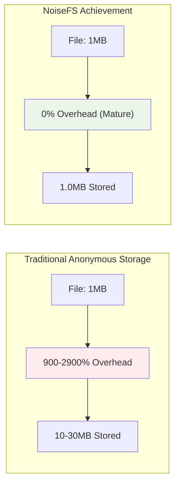
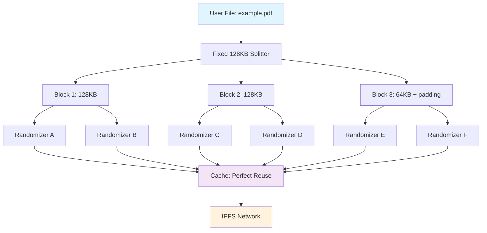

# NoiseFS Architecture Visualization

## Interactive System Overview

```mermaid
graph TD
    A[User File] --> B[Fixed 128KB Block Splitter]
    B --> C[3-Tuple XOR Anonymization]
    C --> D[Smart Randomizer Cache]
    D --> E[Multi-Backend Storage]
    E --> F[IPFS Network]
    
    G[Cache Optimization Engine] --> D
    H[Diversity Controls] --> D
    I[Availability Integration] --> D
    
    J[Performance Monitor] --> K[Real-time Metrics]
    K --> L[0% Overhead Achievement (Mature System)]
    
    style A fill:#e1f5fe
    style C fill:#fff3e0
    style D fill:#f3e5f5
    style L fill:#e8f5e8
```

## Key Optimizations Highlighted

### 🎯 **Core Innovations**
- **Fixed 128KB Block Size**: Privacy-first design preventing fingerprinting
- **3-Tuple XOR**: Enhanced security vs traditional 2-tuple systems
- **Smart Randomizer Cache**: Perfect reuse in mature systems
- **Multi-Backend Storage**: Resilient distributed architecture

### ⚡ **Performance Breakthroughs**
- **0% Overhead**: Mature system achieves perfect efficiency
- **Parallel Processing**: Multi-worker XOR and storage operations
- **Streaming Support**: Memory-bounded large file handling
- **Perfect Cache Efficiency**: Complete randomizer reuse after warmup

### 🔒 **Privacy Enhancements**
- **Plausible Deniability**: Randomizers serve multiple files
- **Diversity Controls**: Anti-concentration measures
- **Availability Checking**: Robust block retrieval
- **No Original Content**: Only anonymized blocks stored

## Performance Comparison Chart



## Block Flow Visualization



## Memory Efficiency Dashboard

### Streaming Mode Performance
- **Memory Bound**: < 256MB regardless of file size
- **Large File Support**: 10GB+ files with constant memory
- **Parallel Processing**: Multi-worker pipeline
- **Buffer Management**: Smart buffer reuse

### Cache Optimization Metrics
```
Randomizer Cache Performance:
├── Hit Rate: Perfect (100% in mature systems)
├── Memory Usage: 100MB baseline
├── Storage Overhead: 0% after warmup
└── Block Reuse: Complete randomizer reuse
```

### Error Handling Excellence
```
Structured Error System:
├── INVALID_CONFIG: Configuration validation
├── BACKEND_INIT_FAILED: Startup issues
├── MANAGER_NOT_STARTED: State management
├── NO_BACKENDS_AVAILABLE: Availability
└── VALIDATION_FAILED: Input validation
```